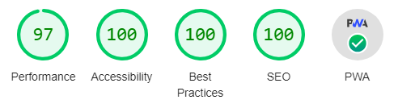

# anirbmuk:profile  
**Anirban Mukherjee (anirbmuk) | Senior Frontend Developer | Professional Bio**  

## Key features  
:heavy_check_mark: Nx monorepo  
:heavy_check_mark: Search engine optimized (SEO)  
:heavy_check_mark: Progressive web application (PWA) enabled  
:heavy_check_mark: Angular universal (SSR) enabled  
:heavy_check_mark: Google analytics  
:heavy_check_mark: Dark mode support

## Lighthouse report  
  

## Technical mumbo-jumbo  
What I wanted   | What I got  
--------------- | --------------
IDE             | MS Visual Studio Code  
Front-end       | Angular 12 / Tailwindcss 
Database        | Google Firestore
SSR & BFF       | NestJS  
Hosting         | Google app engine  
Analytics       | G4A / GTM

## Production: Angular Universal (SSR)  
https://anirbmuk.appspot.com   

## Quick Start & Documentation  
Local development server:  
```
yarn dev  
http://localhost:4200  
```
  
Local SSR run:  
```
yarn dev:ssr  
http://localhost:4300  
```
  
Production build and deployment:  
```
yarn deploy  
https://anirbmuk.appspot.com  
```

- - - -

## Copyright  
(C) anirbmuk, 2022  
